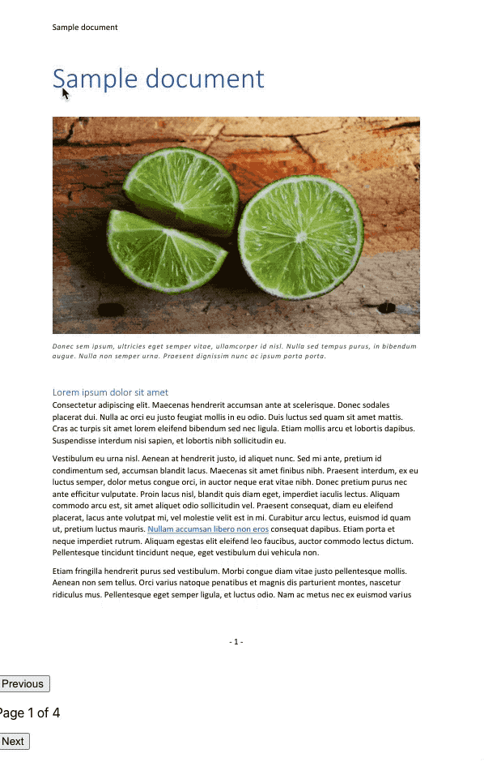
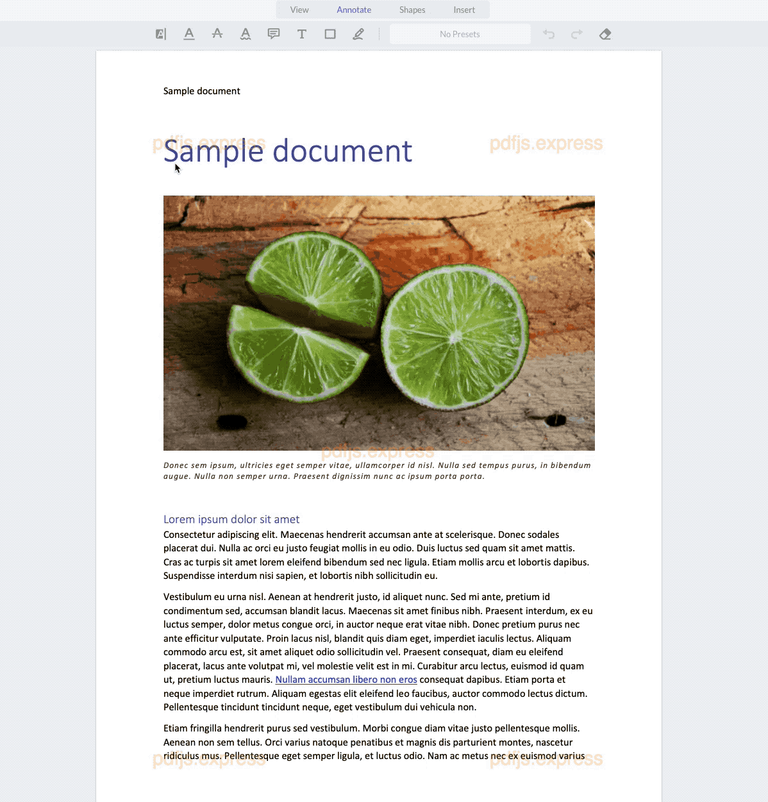
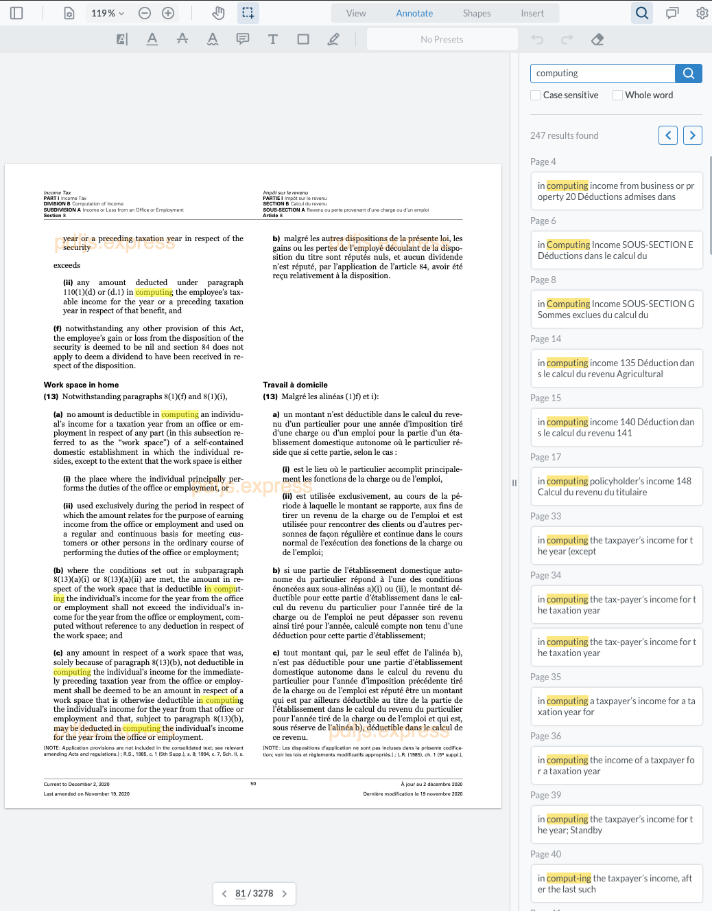

# Do Not Download Your PDF
### A story of digital document usability and security in your application

Web developers have quite a few options for adding a PDF renderer to their web application, and evaluating these options can be time consuming. Here is a guide with samples that compares several PDF library options.

### Adding PDF Support In A Web Application In 2021

#### Downloading or Opening PDFs In A New Tab

Pros
+ no work required

Cons
- we cannot control or enforce any retention policies on the file
- if the document has sensitive information, PDF security alone would not be sufficient (PDF encryption, and PDF do not print flags, content copy, extraction)
- rendering of the content could be different across browsers
- comments or annotations will not be shown

#### Create A Viewer From Scratch

Pros
+ you are starting a PDF company

Cons
- interpreting PDF Specification or ISO 32000-2:2020 with 986 pages
- cannot account for all corner cases and poorly generated PDFs
- will need a lot of resources to support it

#### Leverage An Existing Viewer

The amount features and effort required to get an existing viewer up and running can vary greatly. Some things to consider are:

- Is rendering consistent between browsers
- How much time and effort does it take to integrate the viewer into an existing web application
- Does the viewer support annotations, and if so, does it conform with the PDF specification of representing them as an XFDF
- Does the look and feel conform with your web application's styling? If not, how easy is it to customize the UI?
- Does the viewer have a support team for:
  * Answering questions about the integration process
  * Maintaining the library for when browsers are updated
  * Fixing potential rendering issues
## Let's evaluate a few viewers

Since there are so many PDF library options, I picked several and will try to highlight most common gotchas. For all apps, I ran `npx create-react-app my-pdf-app` and followed the documentation.

### React-PDF

[React PDF](https://www.npmjs.com/package/react-pdf) is one of the more popular libraries out there. It leverages [PDF.js](https://mozilla.github.io/pdf.js/) under the hood and provides ready to go components like `Document` or `Page`.

#### Installation

Documentation is available through [npm](https://www.npmjs.com/package/react-pdf) and [GitHub](https://github.com/wojtekmaj/react-pdf).

```
npm i react-pdf
```

#### First impressions

For some reason, after trying to load my files, I was faced with `Failed to load PDF file`. Checking the console did not yield anything fruitful. Reading documentation further, it seems like I have to host my `PDF.js` worker elsewhere and it was not a plug-n-play solution as I initially hoped. After some time, I was able to get started and render out first page!


However, the text layer was off. At first, it is easy to think you are bad at CSS, but after a quick search seems like an [issue](https://github.com/wojtekmaj/react-pdf/issues/332) from 2019. @nikonet saved the day with his [fix](https://github.com/wojtekmaj/react-pdf/issues/332#issuecomment-458121654). Not an official fix, but oh well. 


Selecting text is a bit of a nightmare, but this is not coming from `react-pdf` but is coming from `PDF.js` and is a known issue.



Searching for any words that have a break in them, does not return the results. There is a [closed issue](https://github.com/wojtekmaj/react-pdf/issues/189) for searching in general where Wojciech reiterates that:

> React-PDF does not aim to be a fully fledged PDF reader, 
> it only gives you an easy way to display PDFs so that you can build some UI around it. 
> You can highlight some words in the text using custom text renderer.

Pros
+ an impressive project by [Wojciech Maj](https://wojtekmaj.pl/)
+ simple enough to get started
+ frequent commits and updates
+ it is free

Cons
- no UI, so a lot of it needs to be implemented
- a lot of common issues or gotchas that are not mentioned in docs or resolved in issues
- still plagued by a lot of issues coming from PDF.js side, for example, when trying to select text

### PDF.js Express

[PDF.js Express](https://pdfjs.express/) is a new player that provides an out of the box UI and annotation support on top of `PDF.js` rendering. 

#### Installation

Documentation and samples is available through [npm](https://www.npmjs.com/package/@pdftron/pdfjs-express) and [website](https://pdfjs.express/documentation/get-started).

```
npm i @pdftron/pdfjs-express
```

After installing, you will need to copy the static files located in `node_modules/@pdftron/pdfjs-express/public` into a place that will be served alongside your other website files.

In the sample, I added a handy `postinstall` script in `package.json`.

#### First impressions

Getting started was much quicker, thanks to good guides. The UI and annotations were available straight out of the box as well. The selection is accurate and does not flash even through it also uses `PDF.js` under the hood. The text selected did run off the page a bit though but overall is better experience.



The searching was problematic in both libraries, but `PDF.js Express` addresses it better with the ability to pick up words with a break in between, however, `PDF.js` still returns incorrect search box positions. 



Pros
+ simple to get started
+ tons of guides and samples
+ annotations and UI is available out of the box
+ UI is available on GitHub and written in React

Cons
- still leverages PDF.js which comes with its own problems

### PDFTron WebViewer


