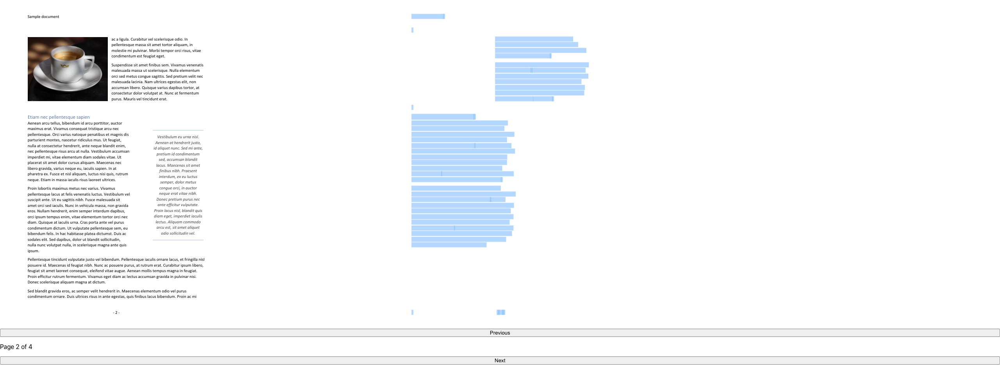

# Do not download your PDF
## A story of digital document usability and security in your application

Users like to leave some of the requirements till the last minute and as such I put together a guide with samples that outlines several PDF libraries that could save you some time. 

### I need to support PDFs within my app, how do I do that?

#### We could let people download or open a PDF in a new tab

Pros
+ no work required

Cons
- we cannot control or enforce any retention policies on the file
- if the document has sensitive information, PDF security alone would not be sufficient (PDF encryption, and PDF do not print flags, content copy, extraction)
- rendering of the content could be different across browsers
- comments or annotations will not be shown

#### We could implement our own viewer

Pros
+ you are starting a PDF company

Cons
- interpreting PDF Specification or ISO 32000-2:2020 with 986 pages
- cannot account for all corner cases and poorly generated PDFs
- will need a lot of resources to support it

#### We could leverage an existing viewer out there

Pros
+ (depending on the library) consistent rendering across browsers
+ (depending on the library) implementation effort
+ (depending on the library) support for annotations
+ (depending on the library) UI
+ (depending on the library) support for any issues

Cons
- (depending on the library) consistent rendering across browsers
- (depending on the library) implementation effort
- (depending on the library) support for annotations
- (depending on the library) UI
- (depending on the library) support for any issues

### Let's evaluate a few viewers

Since there are so many PDF library options, I picked several and will try to highlight most common gotchas.

#### React-PDF

[React PDF](https://www.npmjs.com/package/react-pdf) is one of the more popular libraries out there. It leverages [PDF.js](https://mozilla.github.io/pdf.js/) under the hood and provides a ready to go components like `Document` or `Page`. 

##### Installation

Documentation is available through [npm](https://www.npmjs.com/package/react-pdf) and [GitHub](https://github.com/wojtekmaj/react-pdf).

`npm i react-pdf`

##### First impressions

For some reason, after trying to load my files, I was faced with `Failed to load PDF file`. Checking the console did not yield anything fruitful. Reading documentation further, it seems like I have to host my `PDF.js` worker elsewhere and it is not as simple plug-n-play. After some time, I was able to get started and render out first page!

However, the text layer was off. At first, it is easy to think you are bad at CSS, but after a quick search seems like an [issue](https://github.com/wojtekmaj/react-pdf/issues/332) from 2019. @nikonet saved the day with his [fix](https://github.com/wojtekmaj/react-pdf/issues/332#issuecomment-458121654). Not an official fix, but oh well. 

Selecting text is a bit of a nightmare, but this is not coming from `react-pdf` but is coming from `PDF.js` and is a known issue.

Pros
+ an impressive project by [Wojciech Maj](https://wojtekmaj.pl/)
+ simple enough to get started
+ frequent commits and updates

Cons
- no UI
- a lot of common issues or gotchas that are not mentioned in docs or resolved in issues
- still plagued by a lot of issues coming from PDF.js side, for example, when trying to select text

#### PDF.js Express

[PDF.js Express](https://pdfjs.express/) is a new player that provides an out of the box UI and annotation support on top of `PDF.js` rendering. 

##### Installation

#### PDFTron WebViewer

